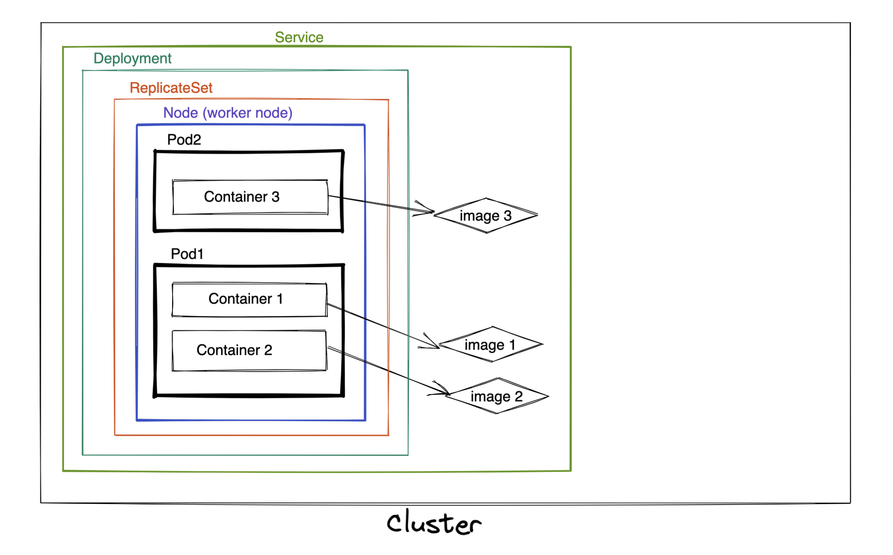

#### useful commands! 
```sh
  lsof -i -P | grep LISTEN | grep 8080
```

```sh
  curl localhost:8080
```

```sh
  minikube ssh
```

```sh
  docker run -e PORT=8080 -p 8080:8080 --name=klaus-hello-world klaus-hello-world
```

```sh
  docker build --rm -t klaus-hello-world .
```

```sh
  minikube ip
```

```sh
  kubectl cluster-info
```

##### https://minikube.sigs.k8s.io/docs/handbook/pushing/
```sh
eval $(minikube docker-env)
  docker build --rm -t klaus-hello-world .
```

```sh
  minikube ssh
    docker ps | grep klaus-hello-world
```

##### https://medium.com/@rakateja/deploying-go-app-on-minikube-using-local-docker-image-81dad14dc7bd

```sh

  kubectl get pods
    kubectl logs klaus-hello-world-deployment-58cdd589ff-xp9qh
  kubectl get deployment klaus-hello-world
  kubectl get services klaus-hello-world-service
  kubectl describe services klaus-hello-world-service
  kubectl get po --all-namespaces
  kubectl get pod -n kube-system
  kubectl config view
```

#### show all events that happened
```sh
  kubectl get events
```

### https://kubernetes.io/ru/docs/reference/kubectl/cheatsheet/

**four types of service in Kubernetes.** https://stackoverflow.com/questions/44110876/kubernetes-service-external-ip-pending

1. ClusterIP - The Service is only reachable from within the cluster.

2. NodePort - You'll be able to communicate the Service from outside the cluster using NodeIP:NodePort.default node port range is 30000-32767, and this range can be changed by define --service-node-port-range in the time of cluster creation.

3. LoadBalancer - Exposes the Service externally using a cloud provider's load balancer.

4. ExternalName - Maps the Service to the contents of the externalName field (e.g. foo.bar.example.com), by returning a CNAME record with its value. No proxying of any kind is set up.

#### inside pod, show existing variables
```sh
  env
```

####
```sh
  minikube ssh
  cd /var/lib/kubelet/pods/
  ls -la # will see ids - ids of existing pods

  # where is config map file?
  ls -la /var/lib/kubelet/pods/<image-ids>/volumes/kubernetes.io~configmap/kube-proxy/config.conf

  echo $Count  # show value of env Count inside of Pod
```


echo -n "now-go-2-home" | base64 
echo -n "bm93LWdvLTItaG9tZQo=" | base64 -d
  есть кодировка и декодировка
  есть шифрование


#### base minimal k8s schema; created by https://excalidraw.com/

